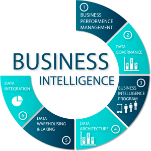

# Inteligencia de Negocios

Este repositorio contiene informacion relacionada con inteligencia de negocios:

1. Conceptos Basicos de Inteligencia de Negocios
1. Modelo Dimensional (Modelo Estrella y Copo de Nieve)
1. Proceso de creacion de ETL en SQL Integration services
1. Automatizacion de los procesos de ETL
1. Visualizacion en Dashboard con Power BI